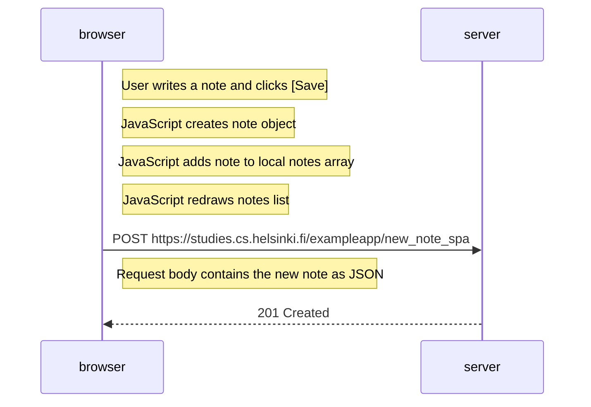

006
- single page app
- on submit, the JScode appends the note to the actual htmlbody of the unordered_list, then sends the note packet to the server, then redraws the notes

```mermaid
sequenceDiagram
    participant browser
    participant server

    Note right of browser: User writes a note and clicks [Save]

    Note right of browser: JavaScript creates note object

    Note right of browser: JavaScript adds note to local notes array

    Note right of browser: JavaScript redraws notes list

    browser->>server: POST https://studies.cs.helsinki.fi/exampleapp/new_note_spa
    Note right of browser: Request body contains the new note as JSON

    server-->>browser: 201 Created
```
