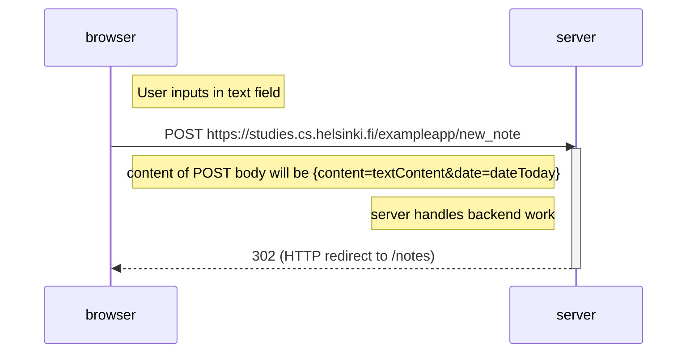

004
- user submits to  "/exampleapp/new_note" via POST

```mermaid
sequenceDiagram
    participant browser
    participant server

    Note right of browser: User inputs in text field
    browser->>server: POST https://studies.cs.helsinki.fi/exampleapp/new_note
    activate server
    Note right of browser: content of POST body will be {content=textContent&date=dateToday}
    Note left of server: server handles backend work
    server-->>browser: 302 (HTTP redirect to /notes)
    deactivate server
```
